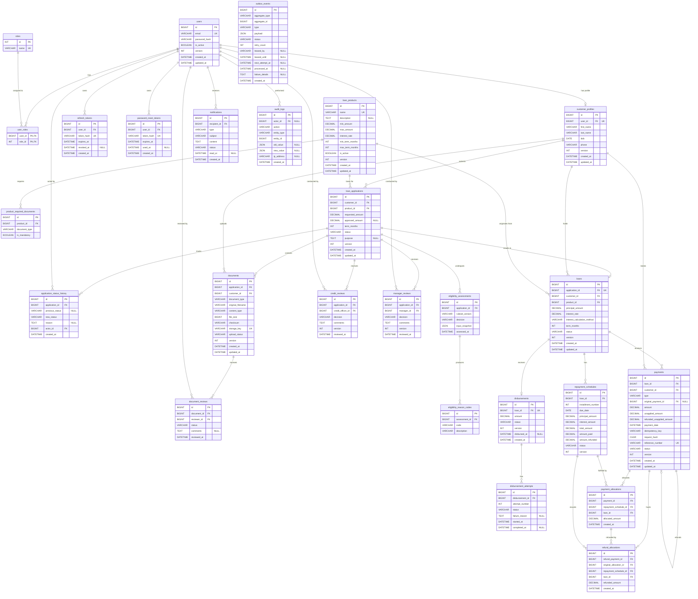

# Entity Relationship Diagram

```mermaid
erDiagram
    %% Auth & User Module
    users {
        BIGINT id PK
        VARCHAR email UK
        VARCHAR password_hash
        BOOLEAN is_active
        INT version
        DATETIME created_at
        DATETIME updated_at
    }
    roles {
        INT id PK
        VARCHAR name UK
    }
    user_roles {
        BIGINT user_id PK, FK
        INT role_id PK, FK
    }
    customer_profiles {
        BIGINT id PK
        BIGINT user_id FK "UK"
        VARCHAR first_name
        VARCHAR last_name
        DATE dob
        VARCHAR phone
        INT version
        DATETIME created_at
        DATETIME updated_at
    }
    refresh_tokens {
        BIGINT id PK
        BIGINT user_id FK
        VARCHAR token_hash UK
        DATETIME expires_at
        DATETIME revoked_at "NULL"
        DATETIME created_at
    }
    password_reset_tokens {
        BIGINT id PK
        BIGINT user_id FK
        VARCHAR token_hash UK
        DATETIME expires_at
        DATETIME used_at "NULL"
        DATETIME created_at
    }

    users ||--o{ user_roles : "has"
    roles ||--o{ user_roles : "assigned to"
    users ||--o| customer_profiles : "has profile"
    users ||--o{ refresh_tokens : "owns"
    users ||--o{ password_reset_tokens : "owns"

    %% Product Module
    loan_products {
        BIGINT id PK
        VARCHAR name UK
        TEXT description "NULL"
        DECIMAL min_amount
        DECIMAL max_amount
        DECIMAL interest_rate
        INT min_term_months
        INT max_term_months
        BOOLEAN is_active
        INT version
        DATETIME created_at
        DATETIME updated_at
    }
    product_required_documents {
        BIGINT id PK
        BIGINT product_id FK
        VARCHAR document_type
        BOOLEAN is_mandatory
    }
    loan_products ||--o{ product_required_documents : "requires"

    %% Application Module
    loan_applications {
        BIGINT id PK
        BIGINT customer_id FK
        BIGINT product_id FK
        DECIMAL requested_amount
        DECIMAL approved_amount "NULL"
        INT term_months
        VARCHAR status
        TEXT purpose "NULL"
        INT version
        DATETIME created_at
        DATETIME updated_at
    }
    application_status_history {
        BIGINT id PK
        BIGINT application_id FK
        VARCHAR previous_status "NULL"
        VARCHAR new_status
        TEXT reason "NULL"
        BIGINT actor_id FK
        DATETIME created_at
    }
    
    customer_profiles ||--o{ loan_applications : "submits"
    loan_products ||--o{ loan_applications : "basis for"
    loan_applications ||--o{ application_status_history : "tracks"
    users ||--o{ application_status_history : "acted by"

    %% Document Module
    documents {
        BIGINT id PK
        BIGINT application_id FK
        BIGINT customer_id FK
        VARCHAR document_type
        VARCHAR original_filename
        VARCHAR content_type
        BIGINT file_size
        VARCHAR checksum
        VARCHAR storage_key UK
        VARCHAR upload_status
        INT version
        DATETIME created_at
        DATETIME updated_at
    }
    document_reviews {
        BIGINT id PK
        BIGINT document_id FK
        BIGINT reviewer_id FK
        VARCHAR status
        TEXT comments "NULL"
        DATETIME reviewed_at
    }
    loan_applications ||--o{ documents : "contains"
    customer_profiles ||--o{ documents : "uploads"
    documents ||--o{ document_reviews : "receives"
    users ||--o{ document_reviews : "reviewed by"

    %% Eligibility Module
    eligibility_assessments {
        BIGINT id PK
        BIGINT application_id FK
        VARCHAR ruleset_version
        VARCHAR decision
        JSON input_snapshot
        DATETIME assessed_at
    }
    eligibility_reason_codes {
        BIGINT id PK
        BIGINT assessment_id FK
        VARCHAR code
        VARCHAR description
    }
    loan_applications ||--o{ eligibility_assessments : "undergoes"
    eligibility_assessments ||--o{ eligibility_reason_codes : "produces"

    %% Review Module
    credit_reviews {
        BIGINT id PK
        BIGINT application_id FK
        BIGINT credit_officer_id FK
        VARCHAR decision
        TEXT comments
        INT version
        DATETIME reviewed_at
    }
    manager_reviews {
        BIGINT id PK
        BIGINT application_id FK
        BIGINT manager_id FK
        VARCHAR decision
        TEXT comments
        INT version
        DATETIME reviewed_at
    }
    loan_applications ||--o{ credit_reviews : "receives"
    users ||--o{ credit_reviews : "conducted by"
    loan_applications ||--o{ manager_reviews : "receives"
    users ||--o{ manager_reviews : "conducted by"

    %% Loan Module
    loans {
        BIGINT id PK
        BIGINT application_id FK "UK"
        BIGINT customer_id FK
        BIGINT product_id FK
        DECIMAL principal_amount
        DECIMAL interest_rate
        VARCHAR interest_calculation_method
        INT term_months
        VARCHAR status
        INT version
        DATETIME created_at
        DATETIME updated_at
    }
    repayment_schedules {
        BIGINT id PK
        BIGINT loan_id FK
        INT installment_number
        DATE due_date
        DECIMAL principal_amount
        DECIMAL interest_amount
        DECIMAL total_amount
        DECIMAL amount_paid
        DECIMAL amount_refunded
        VARCHAR status
        INT version
    }
    loan_applications ||--o| loans : "results in"
    customer_profiles ||--o{ loans : "holds"
    loan_products ||--o{ loans : "originates from"
    loans ||--o{ repayment_schedules : "has"

    %% Payment & Disbursement Module
    disbursements {
        BIGINT id PK
        BIGINT loan_id FK "UK"
        DECIMAL amount
        VARCHAR status
        INT version
        DATETIME disbursed_at "NULL"
        DATETIME created_at
    }
    disbursement_attempts {
        BIGINT id PK
        BIGINT disbursement_id FK
        INT attempt_number
        VARCHAR status
        TEXT failure_reason "NULL"
        DATETIME started_at
        DATETIME completed_at "NULL"
    }
    payments {
        BIGINT id PK
        BIGINT loan_id FK
        BIGINT customer_id FK
        VARCHAR type
        BIGINT original_payment_id FK "NULL"
        DECIMAL amount
        DECIMAL unapplied_amount
        DECIMAL refunded_unapplied_amount
        DATETIME payment_date
        VARCHAR idempotency_key
        CHAR request_hash
        VARCHAR reference_number UK
        VARCHAR status
        INT version
        DATETIME created_at
        DATETIME updated_at
    }
    payment_allocations {
        BIGINT id PK
        BIGINT payment_id FK
        BIGINT repayment_schedule_id FK
        BIGINT loan_id FK
        DECIMAL allocated_amount
        DATETIME created_at
    }
    refund_allocations {
        BIGINT id PK
        BIGINT refund_payment_id FK
        BIGINT original_allocation_id FK
        BIGINT repayment_schedule_id FK
        BIGINT loan_id FK
        DECIMAL refunded_amount
        DATETIME created_at
    }
    loans ||--o| disbursements : "receives"
    disbursements ||--o{ disbursement_attempts : "has"
    loans ||--o{ payments : "receives"
    customer_profiles ||--o{ payments : "makes"
    payments ||--o| payments : "refunds"
    payments ||--o{ payment_allocations : "allocates"
    repayment_schedules ||--o{ payment_allocations : "fulfilled by"
    payments ||--o{ refund_allocations : "funds"
    payment_allocations ||--o{ refund_allocations : "refunded by"
    repayment_schedules ||--o{ refund_allocations : "records"

    %% Notification, Audit & Outbox Module
    notifications {
        BIGINT id PK
        BIGINT recipient_id FK
        VARCHAR type
        VARCHAR subject
        TEXT content
        VARCHAR status
        DATETIME read_at "NULL"
        DATETIME created_at
    }
    audit_logs {
        BIGINT id PK
        BIGINT actor_id FK "NULL"
        VARCHAR action
        VARCHAR entity_type
        BIGINT entity_id
        JSON old_value "NULL"
        JSON new_value "NULL"
        VARCHAR ip_address "NULL"
        DATETIME created_at
    }
    outbox_events {
        BIGINT id PK
        VARCHAR aggregate_type
        BIGINT aggregate_id
        VARCHAR type
        JSON payload
        VARCHAR status
        INT retry_count
        VARCHAR leased_by "NULL"
        DATETIME leased_until "NULL"
        DATETIME next_attempt_at "NULL"
        DATETIME processed_at "NULL"
        TEXT failure_details "NULL"
        DATETIME created_at
    }
    users ||--o{ notifications : "receives"
    users ||--o{ audit_logs : "performed"
```
